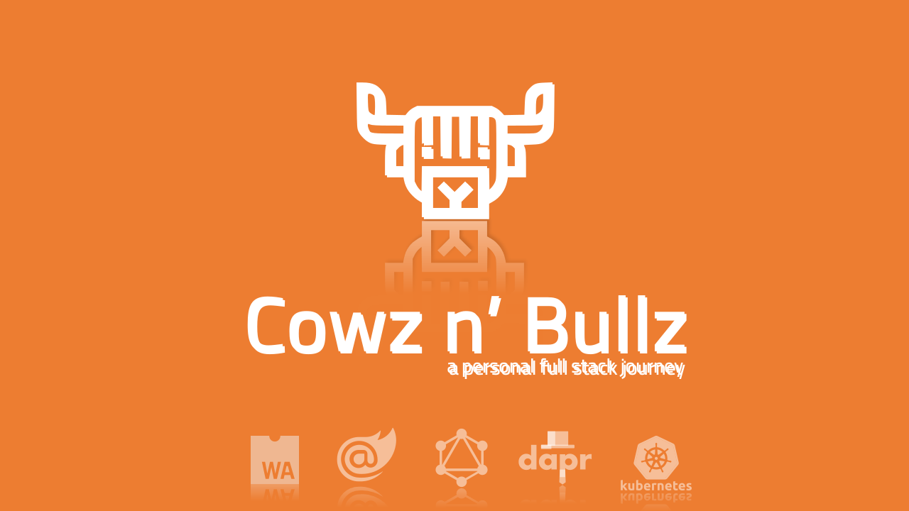

- [Showcase](#showcase)
- [Status](#status)
- [Cowz n' Bullz background](#cowz-n-bullz-background)
  - [Business Requirements](#business-requirements)
    - [Provide digital services](#provide-digital-services)
      - [Dairy farmers](#dairy-farmers)
      - [Wholesalers](#wholesalers)
      - [POS](#pos)
- [High Level Overview](#high-level-overview)
  - [Production Pipeline](#production-pipeline)
  - [Product teams](#product-teams)
  - [Simulation Driven Development](#simulation-driven-development)
    - [Discrete Event Simulation](#discrete-event-simulation)
  - [Micro services/front ends](#micro-servicesfront-ends)
  - [Stack used](#stack-used)
    - [Micro services](#micro-services)
      - [Popularity](#popularity)
      - [Runtime language services](#runtime-language-services)
      - [dapr Release Train](#dapr-release-train)
    - [Micro Service Orchestration](#micro-service-orchestration)
  - [GitOps Overview](#gitops-overview)
- [Setup](#setup)
  - [Install Dapr CLI](#install-dapr-cli)
  - [Clone repo](#clone-repo)
  - [Setting up secrets (important)](#setting-up-secrets-important)
  - [Launch Dev Areas](#launch-dev-areas)
  - [vscode debug launch](#vscode-debug-launch)
    - [Debug all micro services](#debug-all-micro-services)
    - [Service registry and ports](#service-registry-and-ports)
      - [Swagger endpoints](#swagger-endpoints)
      - [GraphQL endpoints](#graphql-endpoints)
      - [GraphQL Gateway](#graphql-gateway)
    - [Install additional tools.](#install-additional-tools)
  - [npm Scripts](#npm-scripts)
    - [gql-doc](#gql-doc)
    - [gql-schemas](#gql-schemas)
    - [gqlg](#gqlg)
    - [test / test-dashboard](#test--test-dashboard)
  - [Zeebe Micro Service Orchestration](#zeebe-micro-service-orchestration)
    - [Docker installation](#docker-installation)
- [Hosting Modes](#hosting-modes)
  - [Micro services](#micro-services-1)
- [Deploying to Kubernetes](#deploying-to-kubernetes)
  - [Setup dapr on Azure AKS kubernetes](#setup-dapr-on-azure-aks-kubernetes)
  - [Setup your container registry (Azure)](#setup-your-container-registry-azure)
  - [Deploying Dapr services (from vscode)](#deploying-dapr-services-from-vscode)
    - [Building your docker containers](#building-your-docker-containers)
    - [Pushing your docker Images](#pushing-your-docker-images)
    - [Managing Secrets](#managing-secrets)
    - [Attaching container Registry](#attaching-container-registry)
    - [Deploying dapr services (HELM)](#deploying-dapr-services-helm)
    - [Exposing Dapr services](#exposing-dapr-services)
      - [Ingress Controller](#ingress-controller)
        - [DNS](#dns)
        - [SSL Certs](#ssl-certs)
        - [K8s Secret for cert](#k8s-secret-for-cert)
        - [Ingress Routes](#ingress-routes)
  - [Administering multi cluster environments](#administering-multi-cluster-environments)
- [GraphQL](#graphql)
  - [Client generator](#client-generator)
    - [Setup client tools](#setup-client-tools)
    - [Fetch the graphql schema](#fetch-the-graphql-schema)
    - [Generate the client](#generate-the-client)
- [GitOps (Azure)](#gitops-azure)
  - [Initial Setup.](#initial-setup)
  - [ARM Deploy](#arm-deploy)
    - [Deploy Container Registry](#deploy-container-registry)
- [Disclaimer](#disclaimer)

# Showcase

This is my fullstack journey for this year with the challenge to build a comprehensive system consisting out of modern (web)technologies. The **fictitious business model of Cowz `n Bullz** challenges this system and what it needs to comprise of. Though my intention is not to build a full system that meets all the business needs of the fictitious business model, it should hit some interesting design challenges along the way.

I hope this journey can be helpful to others in the open source community, that it aspires others to become full-stack engineers or deepening their knowledge about full-stack development in general.

# Status

Very much under construction. Started with the back end and setting up the project backstory, IDE in VSCode, docker containers, npm scripts and the micro services for an integrated development experience. The services are tested with integration tests.

# Cowz n' Bullz background

In 1872, the Cowz n' Bullz cooperative was formed. Farmers began to recognize that if they stood together, they would be stronger. Today, almost 150 years later, many dairy farmers are in the cooperative, doing everything they can for their cows, their land, and the good nutrition they produce every day for the world. As of today, the cooperative caters to Wholesalers. Besides that the company offers supporting services for point of sales (POS) in the region to the local consumer and the dairy farmer.

## Business Requirements

### Provide digital services

Provide services to the stakeholders in the business model.

#### Dairy farmers

As part of the ERP, provide a dashboard  that can monitor the daily local production process for the dairy farmers.

#### Wholesalers

Provide a digital services gateway to place bulk orders.

#### POS

Provide an e-commerce shop, where consumers can order quality dairy products produced by local businesses.

# High Level Overview

High level overview of what I am building.

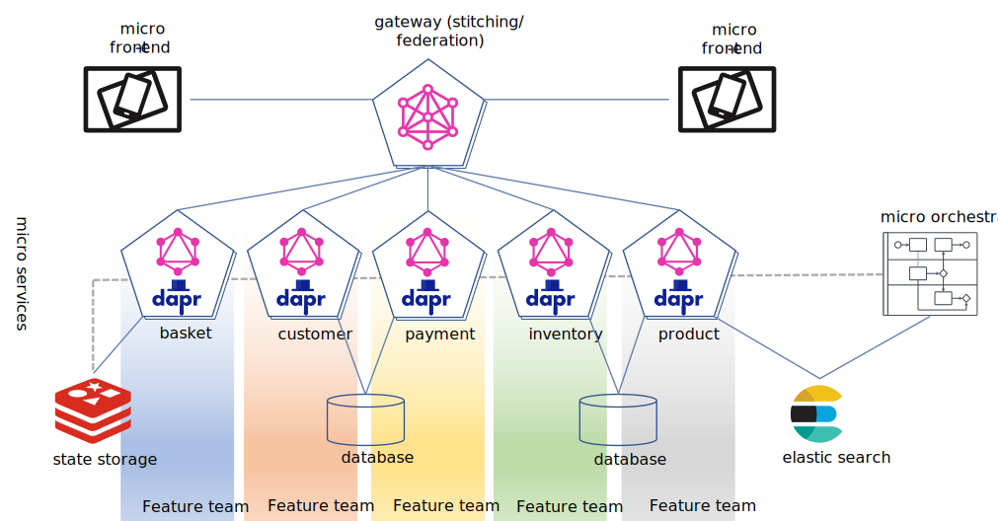
 
The full stack consisting out of:

* Micro Services
* Micro (modular) Front End
* Simulation Driven Development

## Production Pipeline

Cowz n' Bullz has an open communication in its culture. The company current has 3 scrum teams, but is not expected to grow beyond 4 teams in the forseeable future. After looking at various Scaled Agile models, they decide to adopt the Nexus framework.

Nexus' objective is to scale up the value that can be delivered by a group of Scrum Teams (3-8 teams) working on a single product. It does this by reducing the complexity faced by those teams as they work together to deliver at least one integrated, valuable, helpful product increment every Sprint.

## Product teams

Each feature is build by a team of experts. Each feature slice in the product increments are a daily end-to-end exercise for the team. The team consists out of experts in:

* User Experience
* Web & Graphic Design
* [Analytics translation](https://abs.uva.nl/content/open-programmes-abs/analytics-translator/analytics-translator.html) / Data Science
* Solution Architecture / Full Stack Software Engineering
* Operations

As the primary link to the stakeholders, the product owner of Cowz n' Bullz acts as the liaison. While the product owner defines the vision, manages the backlog, prioritizes and anticipates the needs of the customers. He also monitors the development stages and evaluates the quality of the product at each iteration.

The team itself has direct communication from the perspective of users experience design and the analytics translator (business information needs) with the stakeholders when working on the product features.

<h3><p align="center" style="border: dashed">You won’t understand until you experience it</p></h3>

The user experience expert tests visual prototypes with the customer before they are built technically as a feature in the software. In that sense, the Analytics translator and User Experience designer are front-runners in the team and challenge the Spikes the team would be facing so they mitigate the risk in their technical approach.

## Simulation Driven Development

<table border="0">
 <tr>
    <td width=40%>The system of Cowz 'n Bullz integrates with various dairy production plants. Supervisory control and data acquisition (SCADA) sensory data from the production plant is streamed live over the cloud. In order to test event messaging with our micro services, we mimic the production data using discrete event simulation locally.

In the simulation code, we currently use averaging `ptMean` and `ptSigma` for standard deviations in random distributions. Hypothetically we could also extend the model to use real production data and machine learning models, if Cowz n' Bullz was not a fictitious company. These types of simulation could then also be utilized for policy modelling next to software testing.</td>
    <td>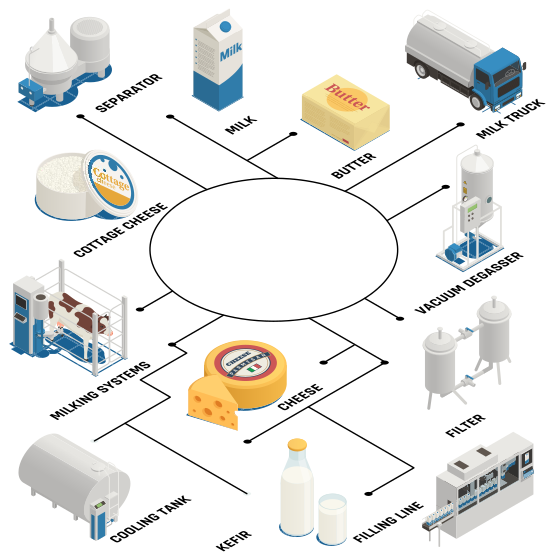</td>
 </tr>
</table>


### Discrete Event Simulation

The production plant data can be generated as follows:

cd to `~/src/simulation/production-plant/discrete-event-simulation`

Issue:

```
dotnet run

Building...
== Dairy Production Plant ==
Dairy Production Plant results after 365 days.

Processed 29060 events in 0.0434367 seconds (669019.5157551103 events/s).
Milked: 7260 animals.
Total Milking Timed: 25.05:01:15.7306465.
```

a `production-data.json` will be generated containing events for a year of production data. This data can be loaded on a streaming server, replaying the data so our micro services can response to the events. The model is kept simple but can be extended with more complex production processes.

## Micro services/front ends

As per business requirements, catering to the stakeholders, the functionality of the system is split up in micro services and micro (modular) front ends. This allows the company to more easily rollout parts that make up the system consisting out of features. The DevOps teams are specialized in GitOps and rollout each future in the infrastructure as code (IAC) with a `you build, it you run it` mentality.

## Stack used

### Micro services

In Microsoft technologies there are mainly three promising technologies. The main reason why I choose dapr over other technologies are as follows:

* Orleans only supports Actors
* More official SDK integrations for multiple languages
* Excellent documentation
* Fastest growing community
* Fast release train

#### Popularity

As per January 29th 2020

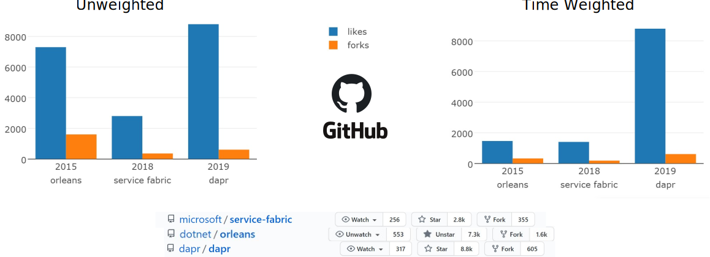

#### Runtime language services

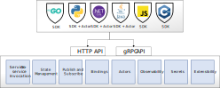

#### dapr Release Train

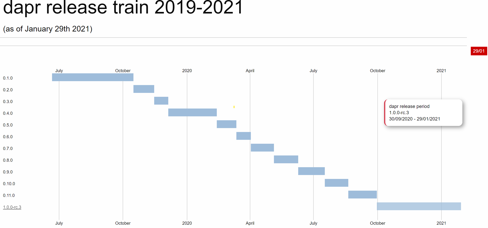

### Micro Service Orchestration

For micro service orchestration we use 3 building blocks from camunda:latest
* [Zeebe](https://github.com/zeebe-io/zeebe) orchestration engine
* [Elastic Search](https://github.com/elastic/elasticsearch) (for storing workflow data)
* [Operate](https://docs.camunda.io/docs/product-manuals/operate/index) for monitoring and troubleshooting workflow instances
* [Monitor](https://github.com/zeebe-io/zeebe-simple-monitor) a simple monitoring application where you can test workflow manually
* [Modeler](https://github.com/zeebe-io/zeebe-modeler/releases) visual workflow for zeebe using BPMN.

## GitOps Overview

Within Scrum Nexus, the teams organize themselves around GitOps. The following high level infographic depicts the continuous integration and delivery and technologies used within the Cowz n' Bulls cooperative.


# Setup

The VSCODE project consists out of Tasks/Launch json configuration. On top of this some utilities are installed as NPM packages. The scripts that are shipped in package.json with the solution are installed as dev dependencies and these node modules are executed with `npx`.

## Install Dapr CLI

The dapr runtime can be installed by following this documentation:
https://v1-rc1.docs.dapr.io/getting-started/install-dapr-cli/

To debug dapr micro services, install dapr in local mode on your dev machine.

```
dapr init --runtime-version v1.0.0-rc.4
```

## Clone repo

```
git clone https://github.com/sjefvanleeuwen/showcase.git
```

To get up and running with dapr solution. `cd to the ./showcase/src/dapr folder` from the root of the cloned repo and install the node modules.

```
cd ./showcase/src/dapr
npm install
```

## Setting up secrets (important)

dapr stores its secrets in the `./src/dapr/secrets.json` file. The secrets component configuration itself can be found in:  `./src/dapr/components/localSecretStore.yaml`. This configuration is used for `standalone mode` during your debug sessions. You will need to replace the full path to match the location of the file on your dev workstation (replace %Your Path%).

```yaml
apiVersion: dapr.io/v1alpha1
kind: Component
metadata:
  name: my-secret-store
  namespace: default
spec:
  type: secretstores.local.file
  version: v1
  metadata:
  - name: secretsFile
    value: %Your Path%/showcase/src/dapr/secrets.json
  - name: nestedSeparator
    value: ":"
```

## Launch Dev Areas

The project is divided in multiple vscode development areas. cd to `~/src` and issue:

```
./launch-dev-areas.ps1
```

You can select multiple areas, each one starts up a VSCODE editor for that area.


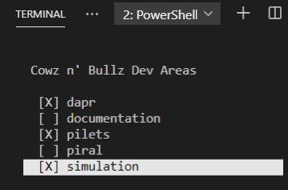

## vscode debug launch

When starting up a new VSCode editor, in `./src/dapr/`, the project contains several launch options. The most important one you will be working with is `debug all microservices`

### Debug all micro services

This will startup the entire environment as depicted in the `high level overview`. At the time of this writing the micro orchestrator is not yet integrated in the debugging experience.

The debug options can be found in the left pane.

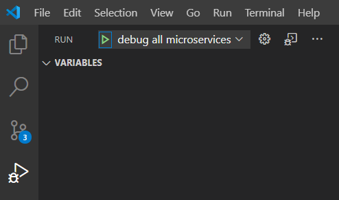

### Service registry and ports

The following URL's will be available as GraphQL service endpoints (and RESTful for that matter) when debugging in standalone mode.

#### Swagger endpoints

| Micro Service                      	| Native                  	| Dapr                                                          	|
|------------------------------------	|-------------------------	|---------------------------------------------------------------	|
| dapr.gql.basket                    	| localhost:10001/swagger 	| localhost:20001/v1.0/invoke/dapr-gql-basket/method    	|
| dapr.gql.customer                  	| localhost:10002/swagger 	| localhost:20002/v1.0/invoke/dapr-gql-customer/method  	|
| dapr.gql.inventory                 	| localhost:10003/swagger 	| localhost:20003/v1.0/invoke/dapr-gql-inventory/method 	|
| dapr.gql.payment                   	| localhost:10004/swagger 	| localhost:20004/v1.0/invoke/dapr-gql-payment/method   	|
| dapr.gql.product                   	| localhost:10005/swagger 	| localhost:20005/v1.0/invoke/dapr-gql-product/method   	|

#### GraphQL endpoints

| Micro Service      	| Native                  	| Dapr                                                          	|
|--------------------	|-------------------------	|---------------------------------------------------------------	|
| dapr.gql.basket    	| localhost:10001/graphql 	| localhost:20001/v1.0/invoke/dapr-gql-basket/method/graphql    	|
| dapr.gql.customer  	| localhost:10002/graphql 	| localhost:20002/v1.0/invoke/dapr-gql-customer/method/graphql  	|
| dapr.gql.inventory 	| localhost:10003/graphql 	| localhost:20003/v1.0/invoke/dapr-gql-inventory/method/graphql 	|
| dapr.gql.payment   	| localhost:10004/graphql 	| localhost:20004/v1.0/invoke/dapr-gql-payment/method/graphql   	|
| dapr.gql.product   	| localhost:10005/graphql 	| localhost:20005/v1.0/invoke/dapr-gql-product/method/graphql   	|

#### GraphQL Gateway

The GraphQL gateway federates all services. The stitching gateway can be opened in your web browser at: http://localhost:9999/graphql when debugging.

Next to federation it also stitches schemas such as `my basket`, to join several graphs from several micro services (basket, product and inventory) into one query endpoint. At the time of this writing, the graphql gateway is still tested to the native graphql query endpoints and will soon change to be served from the dapr endpoints.

Here is the stitching example:

```graphql
# Stitching sub graphs for UX Design of the Basket View
extend type Query {
    "This is an extended query which shows a basket for the current logged in customer along with the products. This view is in accordance with the UX design and contains delegated fields from the inventory and product database"
    mybasket: [BasketItem!]! @delegate(schema: "basket", path: "basketForCustomer(id: 1)")
}

extend type BasketItem {
    "delegates the name of the product in the basket from product"
    name: String
        @delegate(
            schema: "product",
            path: "product(id: $fields:productId).name"
        )
    "delegates the description of the product in the basket from product"
    description: String
        @delegate(
            schema: "product",
            path: "product(id: $fields:productId).description"
        )
    "delegates the unit price of the product"
    unitPrice: Float
        @delegate(
            schema: "product",
            path: "product(id: $fields:productId).unitPrice"
        )
    "delegates the available stock of the product in the basket from the inventory"
    inStock: Int
        @delegate(
            schema: "inventory",
            path: "inventory(id: $fields:productId).quantity"
        )
}

```

### Install additional tools.

Here is a list of tools that will enhance your (debugging) experience with VSCODE for this project:

**dotnet core test explorer**

Unit Test Explorer for .NET Core

https://marketplace.visualstudio.com/items?itemName=formulahendry.dotnet-test-explorer

**dapr extensions**

This Dapr extension makes it easy to setup debugging of applications within the Dapr environment as well as interact with applications via the Dapr runtime.

https://marketplace.visualstudio.com/items?itemName=ms-azuretools.vscode-dapr

**C# for Visual Studio Code (powered by OmniSharp)**

Lightweight development tools for .NET Core.
Great C# editing support, including Syntax Highlighting, IntelliSense, Go to Definition, Find All References, etc. Debugging support for .NET Core

https://marketplace.visualstudio.com/items?itemName=ms-dotnettools.csharp

**Docker**

The Docker extension makes it easy to build, manage, and deploy containerized applications from Visual Studio Code. It also provides one-click debugging of Node.js, Python, and .NET Core inside a container.

https://marketplace.visualstudio.com/items?itemName=ms-azuretools.vscode-docker

**GraphQL**

GraphQL extension VSCode built with the aim to tightly integrate the GraphQL Ecosystem with VSCode for an awesome developer experience.

https://marketplace.visualstudio.com/items?itemName=GraphQL.vscode-graphql

**Live Server**

Launch a local development server with live reload feature for static & dynamic pages.

https://marketplace.visualstudio.com/items?itemName=ritwickdey.LiveServer

**Piral**

This extension is a useful companion when developing Piral based app shells, or pilets for existing app shells.

https://marketplace.visualstudio.com/items?itemName=smapiot.vscode-piral


## npm Scripts

The following section describes the available scripts:

### gql-doc

Documents the graphql schema from the stitching/federated graphql gateway endpoint. Output example [here](https://sjefvanleeuwen.github.io/showcase/schemas/graphql/).

```
npm run gql-doc
```

### gql-schemas

Fetches the schema from the stitching/federated graphql gateway endpoint via curl and places it in the `./generated` folder.

```
npm run gql-schema
```

### gqlg

Generates a javascript server-side (nodejs) graphql client for the gateway. This command is dependent on gql-schema.
*note* this generator can not interpret the @source directive containing a repeatable ENUM. Please remove it from the fetched `schema.graphql` file in the `./generated-folder`
This command is going to be replaced by a better client/server code generator. Such as the one available at: https://graphql-code-generator.com/

```
npm run gqlg
```
### test / test-dashboard

Executes newman integration tests from the ./tests directory, which contains postman configurations. It exports the test results using a html reporter `newman-reporter-html-extra`

This command generates a new test report per run, with date/time stamp in the filename and puts it in the `./tests/` folder.

```
npm run test
```

This command overwrites a test file in the `../docs/tests/newman folder`. Putting the live webserver on that file will result in the dashboard updated in the browser at each run. Good for dashboard's.

```
npm run test-dashboard
```

You can see an example of the dashboard [here](https://sjefvanleeuwen.github.io/showcase/tests/newman/dashboard.html)

## Zeebe Micro Service Orchestration

### Docker installation

Zeebe can be setup using docker-compose. cd to the `./src/orchestration/zeebe/operate-simple-monitor`.

```
docker-compose up
```

Camunda operate should now be available at: http://localhost:9998/

```
u/l: demo/demo
```

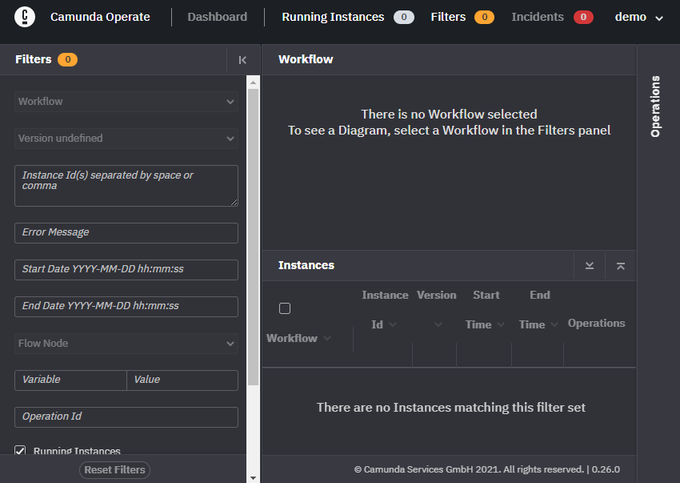

# Hosting Modes

## Micro services

At this time the micro services run in self hosted mode. The eventual "production" mode is targeted towards kubernetes.

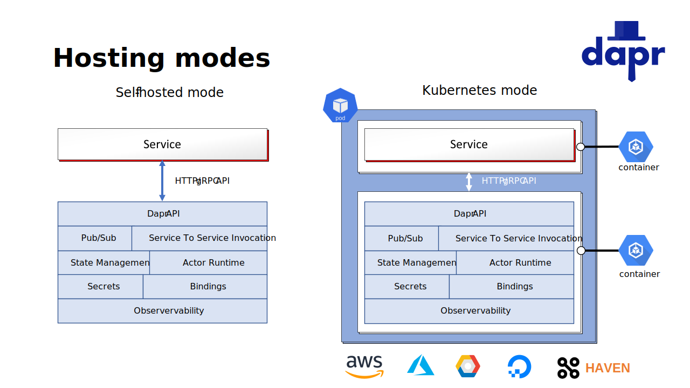

# Deploying to Kubernetes

Time to shift our focus on the Kubernetes hosting mode. This is also known as `Dapr First`. Dapr is a world class citizen when it comes to deployment to kubernetes. We will be deploying the dapr solution to the Azure cloud using `azure cli`.

## Setup dapr on Azure AKS kubernetes

Please follow the guide [here](./docs/kubernetes/setup-aks-cluster.md)

## Setup your container registry (Azure)

Please follow the guide [here](./docs/docker/setup-azure-container-registry.md)

## Deploying Dapr services (from vscode)

The `./src/dapr` project comes with a .sln file, binding all services together. When developing larger services landscapes these can be separated out as you scale your application. For now however we can make use of one of the Tasks that will containerize our services in order to get ready for kubernetes deployment via the Azure service registry you have already set up by now.

### Building your docker containers

In vscode, got to the task run list by pressing ctrl+ shift+p to open the command palette.

From the list pick `Task: Run Task`

Select the `build all dockers: latest`.

This will build the containers for the micro services, including the gateway

If you installed the visual studio extension for docker as indicated under `Install additional tools` in this document, you can easily check if the images are build for your docker installation.

The images list should contain the `basket, customer, inventory and payment` micro services. Also the `gql.gateway` should be in the list.

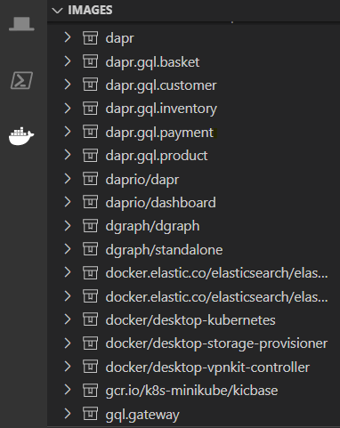

### Pushing your docker Images

We will be pushing our images to the previously created Azure Container Registry in your resource group.
In the docker pane in vscode you see a registry menu.

1. Click on Connect Registry
2. Choose Azure
3. Open the Azure tree
4. Click on `Install Azure Account Extension`
5. Install the Extension
6. Sign In to Azure 

The created container registry should now appear in the view pane.

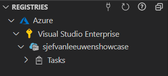

Now push all 6 images to the registry that are tagged :latest.

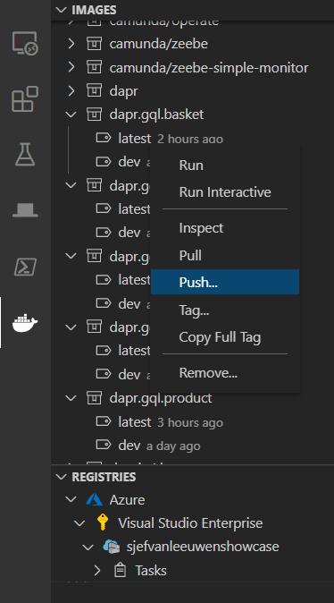

The Azure portal should show all images in its repositories menu for the resource group.

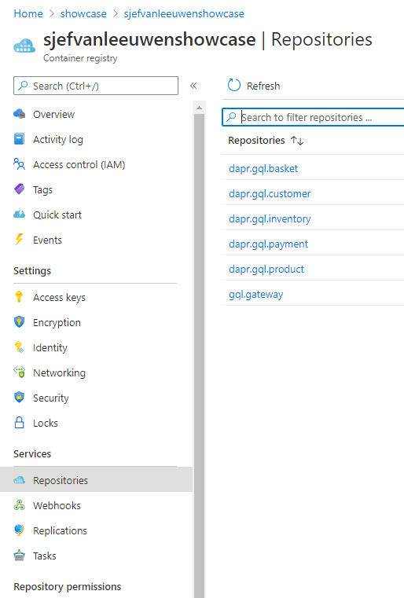

### Managing Secrets

Secrets will be kept separate from our code to enforce secure software development.
For this we use the built in kubernetes built-in secret store.

You can create a secret via the kubectl cli. For now we create the same test secret that we use in standalone dapr mode for integration testing.

```
kubectl create secret generic my-secret-store --from-literal='my-secret'='If you want to keep a secret, you must also hide it from yourself. -- George Orwell, 1984'
secret/my-secret-store created
```

**!Note** You should encrypt secrets in kubernetes as they are stored in plane text as base64. If you are on azure, take a look at Key Vault. Azure Key Vault is a secret management platform that provides a secure repository for keys, secrets, and certificates. It offers deep integration with other Azure services and provides a highly secure repository for your most sensitive data.

### Attaching container Registry

You can attach the container registry to your AKS cluster that you created and pushed the images to. remember to replace the name of the `acr` to your own unique container registry name.

```
az aks update --name showcase --resource-group showcase --attach-acr sjefvanleeuwenshowcase

```

This wil take less than a minute usually. 

### Deploying dapr services (HELM)

You can find HELM files in the ./charts folder. You can change the `values.yaml` in the micro-services chart. Specifically change the `localhost:9997` to your own registry on AKS. If you like to run a local registry and kubernetes on docker desktop, or micro k8s for example you can install a docker registry yourself.

```
docker run -d -p 9997:5000 --restart=always --name registry registry:2
```

```yaml
range:
    - image: localhost:9997/dapr.gql.basket
      name: dapr-gql-basket
    - image: localhost:9997/dapr.gql.customer
      name: dapr-gql-customer
    - image: localhost:9997/dapr.gql.inventory
      name: dapr-gql-inventory
    - image: localhost:9997/dapr.gql.payment
      name: dapr-gql-payment
    - image: localhost:9997/dapr.gql.product
      name: dapr-gql-product
    - image: localhost:9997/gql.gateway
      name: gql-gateway
```

You can deploy the micro services to your kubernetes cluster using

```
helm install micro-services ./micro-services
```

To check if the basket container is running.

```
kubectl logs -l app=dapr-gql-basket -c dapr-gql-basket

info: Microsoft.Hosting.Lifetime[0]
      Now listening on: http://[::]:80
info: Microsoft.Hosting.Lifetime[0]
      Application started. Press Ctrl+C to shut down.
info: Microsoft.Hosting.Lifetime[0]
      Hosting environment: Production
info: Microsoft.Hosting.Lifetime[0]
      Content root path: /app
info: Microsoft.Hosting.Lifetime[0]
      Now listening on: http://[::]:80
info: Microsoft.Hosting.Lifetime[0]
      Application started. Press Ctrl+C to shut down.
info: Microsoft.Hosting.Lifetime[0]
      Hosting environment: Production
info: Microsoft.Hosting.Lifetime[0]
      Content root path: /app
```

You can also go to your previously installed dashboard to see the basket service running. If its not running issue:

```
dapr dashboard -k
```

browse to: http://localhost:8080/

You should see the basket micro service running.

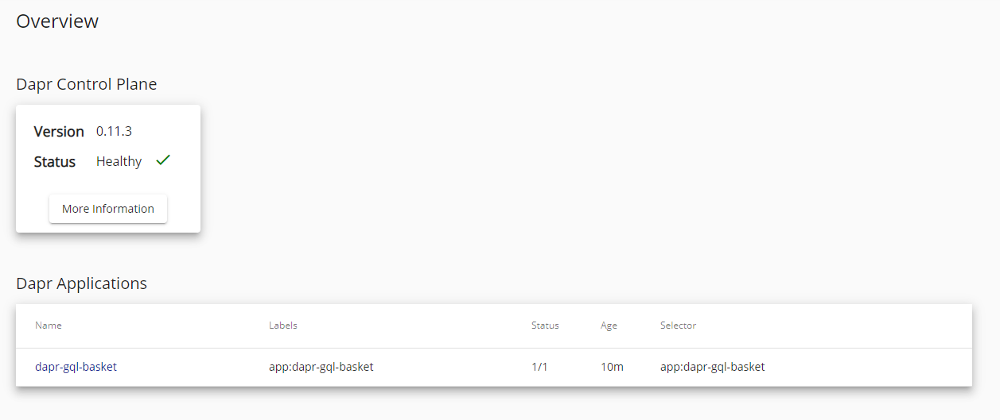

### Exposing Dapr services

First we are going to expose the basket service to our development workstation so we can perform a query to it using graphql. We could instead expose the gateway, but lets keep things simple as that needs more wiring. This will be a manual exercise, but eventually will be done using automated deployments using GitOps.

#### Ingress Controller

Dapr fully integrates with Azure API management. If you want to use this instead of setting up you own generic ingress controller check this link: 

https://docs.microsoft.com/en-us/azure/api-management/api-management-dapr-policies

Our ingress controller will be NGINX. Instructions for this can be found on: 

https://docs.microsoft.com/en-us/azure/aks/ingress-basic

For deployment of nginx you can go to the `~/src/dapr/k8s/deployment/ingresses folder.

Execute the following command from powershell

```
./nginx-ingress
```

Wait for a couple seconds, until the script executes the `kubectl --namespace ingress-basic get services -o wide -w nginx-ingress-ingress-nginx-controller` in order to view the status of the nginx ingress getting an external IP address assigned.

```
nginx-ingress-ingress-nginx-controller   LoadBalancer   10.0.96.37   <pending>     80:31982/TCP,443:31005/TCP   4s    app.kubernetes.io/component=controller,app.kubernetes.io/instance=nginx-ingress,app.kubernetes.io/name=ingress-nginx
nginx-ingress-ingress-nginx-controller   LoadBalancer   10.0.96.37   20.67.176.154   80:31982/TCP,443:31005/TCP   15s   app.kubernetes.io/component=controller,app.kubernetes.io/instance=nginx-ingress,app.kubernetes.io/name=ingress-nginx
```

After 15 seconds, our ingress controller is available on public load balancer IP: 20.67.176.154. Of course this IP address will differ from your setup.

When browsing to https://20.67.176.154 you will see the nginx server online it gives back a 404 error as nothing has been wired yet. Also note that the NGINX server still needs a trusted certificate.

More info about setting up TLS and DNS can be found here: https://docs.microsoft.com/en-US/azure/aks/ingress-tls in case you want to use different options available to you than set forth here.

##### DNS

Before issuing a SSL cert we need to setup DNS for 20.67.176.154. I choose to use my external DNS provider, as I have my FQDN's setup there already. Simply create an A-Record pointing to your NGINX IP-Address.

##### SSL Certs

Make sure you have the openssl tooling available. You can install this using chocolatey for example, see: https://chocolatey.org/packages/openssl

```
choco install openssl.light
```

Restart your command shell for the command the become available.

Please replace the FQDN under the Canonical Name (CN) with your own FQDN A record.

We will be creating a self signed certificate and key.

```
openssl req -x509 -nodes -days 365 -newkey rsa:2048 -out aks-ingress-tls.crt  -keyout aks-ingress-tls.key -subj "/CN=dapr-ingress.morstead.nl/O=aks-ingress-tls"
```

This will create two files, being the request certificate and key. The

##### K8s Secret for cert

To allow Kubernetes to use the TLS certificate and private key for the ingress controller, you create and use a Secret. The secret is defined once, and uses the certificate and key file created in the previous step. You then reference this secret when you define ingress routes.

The following example creates a Secret name aks-ingress-tls:

```
kubectl create secret tls aks-ingress-tls --namespace ingress-basic --key aks-ingress-tls.key --cert aks-ingress-tls.crt
```
```
secret/aks-ingress-tls created
```

We can now reference the secret `aks-ingress-tls` when we create the ingress routes to our services using a spec file.

##### Ingress Routes

t.b.a.

## Administering multi cluster environments 

Now that the kubctl client is set to your azure environment, you can also switch between multiple environments. For example when using Kubernetes on Docker Desktop you can tell kubctl to point to that environment at any time.

To see which configs are available to kubectl, issue:

```
kubectl config view
```

```yaml
...
apiVersion: v1
clusters:
- cluster:
    certificate-authority-data: DATA+OMITTED
    server: https://kubernetes.docker.internal:6443
  name: docker-desktop
- cluster:
    certificate-authority-data: DATA+OMITTED                          azmk8s.io:443
    server: https://xxxxxxxxxxxxxxxxxxxxxxxxxxxxxxxxxxxxx.azmk8s.io:443
  name: showcase
...
```

Listed on my machine are two environments, `docker-desktop` an internal kubernetes "cluster" and `showcase` which we created in our previous exercise.

To switch back to docker-desktop issue:

```
kubectl config use-context docker-desktop
```

And we're back.


# GraphQL

## Client generator

For service to service communication we can leverage graphql. The follow example shows how to create a client for the basket service, which needs to synchronously call the inventory to reserve product items. Consider the following activity diagram.

]

The basket services requests the reserve mutation service, for this it needs the mutation operation schema from the inventory service.

### Setup client tools

In order to do so, run the inventory service from VSCODE. cd to `src/dapr/dapr.gql.basket/Client`

In this directory we have setup the client as follows:

```
dotnet new tool-manifest
dotnet tool install StrawberryShake.Tools --local --version 11.0.0-preview.137
```

### Fetch the graphql schema

To generate a new client based on the operations from the inventory service, make sure the inventory service is running. Then generate a strongly typed client by executing:

```
dotnet graphql init http://localhost:10003/graphql -n Inventory
```

```
Download schema started.
Download schema completed in 978 ms
Client configuration started.
Client configuration completed in 12 ms
```

2 files will now be in the Client directory.

* berry.json
* Inventory.graphql

Furthermore, a `.config` directory, containing dotnet-tools.json contains the version of the tool used.

```json
{
  "version": 1,
  "isRoot": true,
  "tools": {
    "strawberryshake.tools": {
      "version": "11.0.0-preview.137",
      "commands": [
        "dotnet-graphql"
      ]
    }
  }
}
```

### Generate the client

Create the query or mutation you want to generate code for as a new file: `ReserveMutation.graphql`

```graphql
mutation Reserve {
    reserve {
        productId
        quantity
    }
}
```

Now build the project, a `./Generated` directory will be created containing the strongly typed client code.

```
dotnet build ../
```

The `ReserveMutation` client can now be used.

# GitOps (Azure)

All the manual steps can be easily scripted using template generators on azure for the resources. These templates can then be used in GitHub Workflows.

## Initial Setup.

To start with github workflows we first need to create deployment credentials, or rather service principal for a resource. We could reuse the existing `showcase` resource group, but the keep things separated, lets create a new resource.

```
az group create --location northeurope -n showcase-gitops
```

```json
{
  "id": "/subscriptions/xxxxxxxx-xxxx-xxxx-xxxx-xxxxxxxxxxxx/resourceGroups/showcase-gitops",
  "location": "northeurope",
  "managedBy": null,
  "name": "showcase-gitops",
  "properties": {
    "provisioningState": "Succeeded"
  },
  "tags": null,
  "type": "Microsoft.Resources/resourceGroups"
}
```

We will now create the service principal. Replace xxxxxxxx-xxxx-xxxx-xxxx-xxxxxxxxxxxx with your subscription ID, as indicated in the Json above.

```
az ad sp create-for-rbac --name showcase-gitops --role contributor --scopes /subscriptions/xxxxxxxx-xxxx-xxxx-xxxx-xxxxxxxxxxxx/resourceGroups/showcase-gitops --sdk-auth
```
```json
{
  "clientId": "xxxxxxxx-xxxx-xxxx-xxxx-xxxxxxxxxxxx",
  "clientSecret": "xxxxxxxx-xxxx-xxxx-xxxx-xxxxxxxxxxxx",
  "subscriptionId": "xxxxxxxx-xxxx-xxxx-xxxx-xxxxxxxxxxxx",
  "tenantId": "xxxxxxxx-xxxx-xxxx-xxxx-xxxxxxxxxxxx",
  "activeDirectoryEndpointUrl": "https://login.microsoftonline.com",
  "resourceManagerEndpointUrl": "https://management.azure.com/",
  "activeDirectoryGraphResourceId": "https://graph.windows.net/",
  "sqlManagementEndpointUrl": "https://management.core.windows.net:8443/",
  "galleryEndpointUrl": "https://gallery.azure.com/",
  "managementEndpointUrl": "https://management.core.windows.net/"
}
```

The following keys need to be stored as secrets in your github account.

1. Go to the repository, where you forked this repo.
2. Go into the project settings / secrets / new secret
3. Paste the payload from above into `AZURE_SHOWCASE_CREDENTIALS`
4. Add a secret for the resource group name it `AZURE_SHOWCASE_RESOURCE_GROUP_NAME` with the value: showcase-gitops
5. Add a secret for your subscription ID name it `AZURE_SHOWCASE_SUBSCRIPTION_ID` with your subscription ID value i.e: `c6e66c96-b1ec-48e8-84a7-33dafbd2b314`
6. Add a secret for your container registry name `AZURE_SHOWCASE_CONTAINER_REGISTRY_NAME` and add a azure wide unique container registry name i.e: `yournameshowcasegitops`
7. Add the region under secret `AZURE_SHOWCASE_REGION` i.e.: `northeurope`

## ARM Deploy

In this repository, the resource management templates are included in ./src/git-ops we are going to deploy these using ARM Deploy using the GitHub workflow activity `azure/arm-deploy@v1`

### Deploy Container Registry

This script setups the container registry so the containers of our solution that get published there can be used by our Kubernetes (AKS) Cluster.

[Workflow](./github/../.github/workflows/deploy-container-registry.yml)

[Arm Template](./src/git-ops/deploy-container-registry.json)

For the container registry we will need to set up some more secrets

We can obtain the values (token based login) by logging in to the azure container registry.

```
az acr login --name {your-container-registry-name} --expose-token
```

```
You can perform manual login using the provided access token below, for example: 'docker login loginServer -u 00000000-0000-0000-0000-000000000000 -p accessToken'
{
  "accessToken": "base64tokenstring",
  "loginServer": "{your-acr-name}.azurecr.io"
}
```

Assign these to the following github secrets:

1. `AZURE_SHOWCASE_CONTAINER_REGISTRY_LOGIN_SERVER` value: loginServer
2. `AZURE_SHOWCASE_CONTAINER_REGISTRY_USERNAME` value: 00000000-0000-0000-0000-000000000000
3. `AZURE_SHOWCASE_CONTAINER_REGISTRY_PASSWORD` value: accessToken

# Disclaimer

This is a fictional work. All the names, characters, companies, places, events and incidents in this exercise are either the product of the imagination of the author or used in a fictitious way, unless otherwise stated. It is purely coincidental to have any resemblance to actual individuals, living or dead, or actual events.

As per MIT license, The software is provided "AS IS" without any kind of warranty, express or guarantee. Please read the full license [here](./LICENSE).
