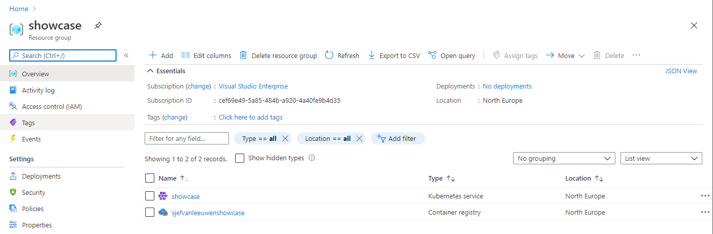

# Setup Azure container registry

Assuming that you already setup the `showcase` resource group as described in [Setup AKS Cluster](../kubernetes/setup-aks-cluster.md), we are ready to setup a private container registry in that group.

You will need to setup an unique Azure name for the registry as alphanumeric characters with a length of (5-50). In my case, I am using: "sjefvanleeuwenshowcase"

We can create the registry using `az cli`.

```
az acr create --resource-group showcase --name sjefvanleeuwenshowcase --sku Basic
```

When visiting your resource group in the azure portal, you should see the created private container registry next to your AKS cluster.



This concludes setting up your private registry.