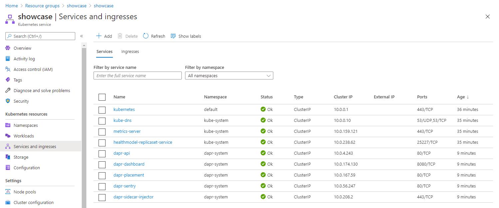
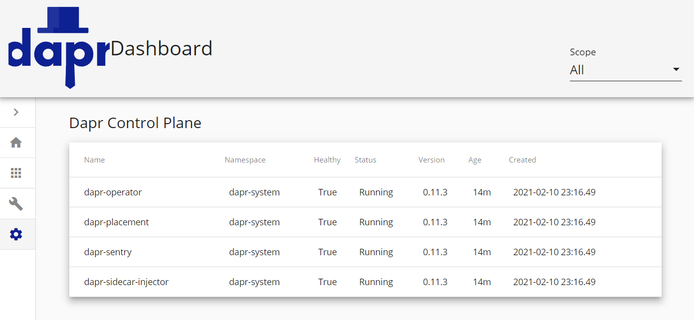

- [Setup dapr on Kubernetes](#setup-dapr-on-kubernetes)
  - [Jump to Hyperspace](#jump-to-hyperspace)
  - [Verify Installation](#verify-installation)
  - [Setup dapr dashboard](#setup-dapr-dashboard)

# Setup dapr on Kubernetes

## Jump to Hyperspace

On our local machine, we previously setup darp in `standalone mode`.

We will need to make te jump to hyperspace again. As the kubectl is has now merged credentials with AKS through the `az aks cli`. We can easily install dapr runtime on the cluster.

```
dapr init -k
```

```
Making the jump to hyperspace...
Note: To install Dapr using Helm, see here:  https://docs.dapr.io/getting-started/install-dapr/#install-with-helm-advanced

Deploying the Dapr control plane to your cluster...
Success! Dapr has been installed to namespace dapr-system. To verify, run `dapr status -k' in your terminal. To get started, go here: https://aka.ms/dapr-getting-started
```

The dapr runtime is now installed. It has installed the dapr components in the cluster. 

## Verify Installation

To verify the installation use the dapr cli.

```
dapr status -k
```

```
  NAME                   NAMESPACE    HEALTHY  STATUS   REPLICAS  VERSION  AGE  CREATED
  dapr-sidecar-injector  dapr-system  True     Running  1         0.11.3   1m   2021-02-11 00:16.49
  dapr-placement         dapr-system  True     Running  1         0.11.3   1m   2021-02-11 00:16.49
  dapr-operator          dapr-system  True     Running  1         0.11.3   1m   2021-02-11 00:16.49
  dapr-dashboard         dapr-system  True     Running  1         0.3.0    1m   2021-02-11 00:16.49
  dapr-sentry            dapr-system  True     Running  1         0.11.3   1m   2021-02-11 00:16.49
```

This command returns the same information as:

```
kubectl get pods -n dapr-system
```

```
NAME                                    READY   STATUS    RESTARTS   AGE
dapr-dashboard-fc859996-wzj4k           1/1     Running   0          2m37s
dapr-operator-7c8cb4b49f-rtglt          1/1     Running   0          2m37s
dapr-placement-56cdb9cd55-87g8f         1/1     Running   0          2m37s
dapr-sentry-6b8948f6d4-7dl9f            1/1     Running   0          2m37s
dapr-sidecar-injector-59897cb89-9hskc   1/1     Running   0          2m37s
```

To list the cluster-ip's you can query the services:

```
kubectl get services -n dapr-system
```

```
NAME                    TYPE        CLUSTER-IP     EXTERNAL-IP   PORT(S)    AGE
dapr-api                ClusterIP   10.0.4.243     <none>        80/TCP     3m52s
dapr-dashboard          ClusterIP   10.0.174.130   <none>        8080/TCP   3m52s
dapr-placement          ClusterIP   10.0.167.59    <none>        80/TCP     3m52s
dapr-sentry             ClusterIP   10.0.56.247    <none>        80/TCP     3m52s
dapr-sidecar-injector   ClusterIP   10.0.208.2     <none>        443/TCP    3m52s
```

You can also visit the azure portal to see the services running.



## Setup dapr dashboard

You can easily setup the dashboard on your localhost pointing to the azure AKS cluster.

```
dapr dashboard -k
```

```
Dapr dashboard found in namespace:      dapr-system
Dapr dashboard available at:    http://localhost:8080
```



This concludes the dapr runtime setup on AKS.
