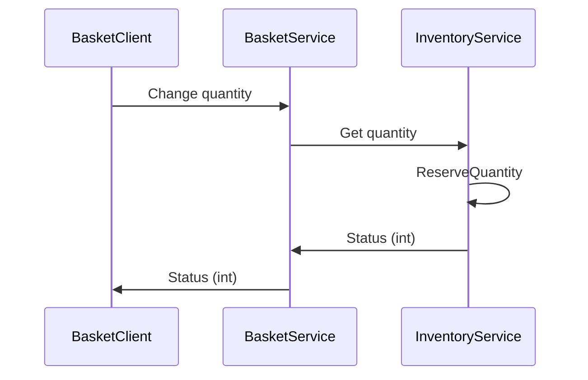

# Basket Processes

These are some notes that have not been processed yet in the documentation.




[](https://mermaid-js.github.io/mermaid-live-editor/#/edit/eyJjb2RlIjoic2VxdWVuY2VEaWFncmFtXG4gICAgcGFydGljaXBhbnQgQmFza2V0Q2xpZW50XG4gICAgcGFydGljaXBhbnQgQmFza2V0U2VydmljZVxuICAgIEJhc2tldENsaWVudC0-PkJhc2tldFNlcnZpY2U6IENoYW5nZSBxdWFudGl0eVxuICAgIHBhcnRpY2lwYW50IEludmVudG9yeVNlcnZpY2VcbiAgICBCYXNrZXRTZXJ2aWNlLT4-SW52ZW50b3J5U2VydmljZTogR2V0IHF1YW50aXR5XG4gICAgSW52ZW50b3J5U2VydmljZSAtPj4gSW52ZW50b3J5U2VydmljZTogUmVzZXJ2ZVF1YW50aXR5XG4gICAgSW52ZW50b3J5U2VydmljZSAtPj4gQmFza2V0U2VydmljZTogUmVzdWx0IChpbnQpXG4gICAgQmFza2V0U2VydmljZSAtPj4gQmFza2V0Q2xpZW50OiBSZXN1bHQgKGludClcbiIsIm1lcm1haWQiOnsidGhlbWUiOiJkZWZhdWx0In0sInVwZGF0ZUVkaXRvciI6ZmFsc2V9)

The basket communicates with the inventory service using a graphql client.

`src/dapr/dapr.gql.basket/Client`

In this directory we have setup the client as follows:

```
dotnet new tool-manifest
dotnet tool install StrawberryShake.Tools --local --version 11.0.0-preview.137
```

To generate a new client based on the operations from the iventory service, make sure the inventory service is running. Then generate a strongly typed client by executing:

```
dotnet graphql init http://localhost:10003/graphql -n Inventory
```

```
Download schema started.
Download schema completed in 978 ms
Client configuration started.
Client configuration completed in 12 ms
```

2 files will now be in the Client directory.

* berry.json
* Inventory.graphql

Furthemore a `.config` directory, containing dotnet-tools.json contains the version of the tool used.

```json
{
  "version": 1,
  "isRoot": true,
  "tools": {
    "strawberryshake.tools": {
      "version": "11.0.0-preview.137",
      "commands": [
        "dotnet-graphql"
      ]
    }
  }
}
```

Create the query or mutation you want to generate code for as a new file: `ReserveMutation.graphql`

```graphql
mutation Reserve {
    reserve {
        productId
        quantity
    }
}
```

Now build the project, a `./Generated` directory will be created containing the strongly typed cient code.

```
dotnet build ../
```

Using the client:

```